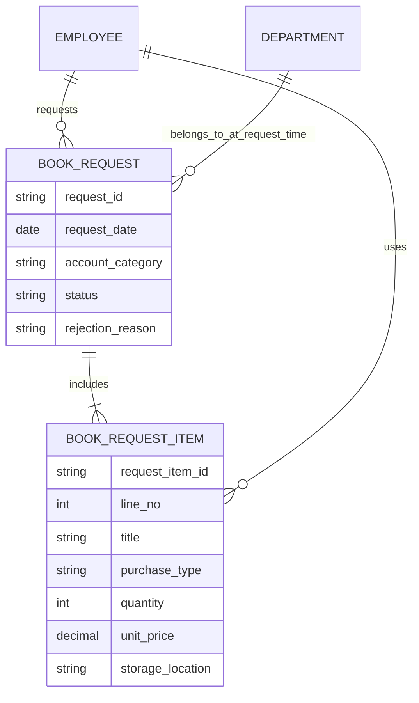
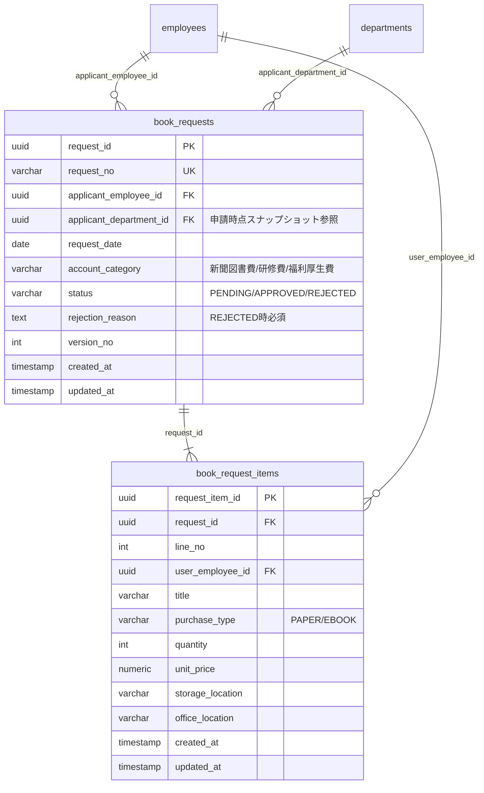

# 課題3 回答：書籍購入申請

## 概念モデル

## 論理モデル

## 説明

### 申請（ヘッダ）と明細の分割理由とキー設計
- 申請共通情報（申請者、勘定科目、承認状態）はヘッダ `book_requests` に集約。
- 書籍ごとの情報（使用者、タイトル、保管場所、購入種別）は明細 `book_request_items` に分離し、1申請多明細を実現。
- 明細識別は `request_item_id` を主キーとしつつ、表示順・業務整合のため `request_id + line_no` を一意制約にする。

### 申請時点の所属部門をどのように保持するか
- `book_requests.applicant_department_id` に申請時点の部門IDを保存する（履歴由来のスナップショット）。
- これにより、申請後に社員が異動しても申請書上の部門情報は変化しない。

### 承認状態（Pending/Approved/Rejected）と却下理由の整合性をどう担保するか
- `status` は列挙値制約（`PENDING/APPROVED/REJECTED`）で排他的に管理。
- `status=REJECTED` の場合のみ `rejection_reason` 必須、`status!=REJECTED` の場合は空を強制（CHECK制約 + APIバリデーション）。

### （任意）将来の「オフィス保管書籍管理」へ拡張する場合の方針
- 現時点では明細の `office_location` と `storage_location` を保持し、将来は `book_assets`（現物台帳）を追加して購入明細から採番連携する。
- 台帳側で棚卸状態、貸出状態、廃棄状態を持つ設計に拡張し、申請データとは疎結合に保つ。
